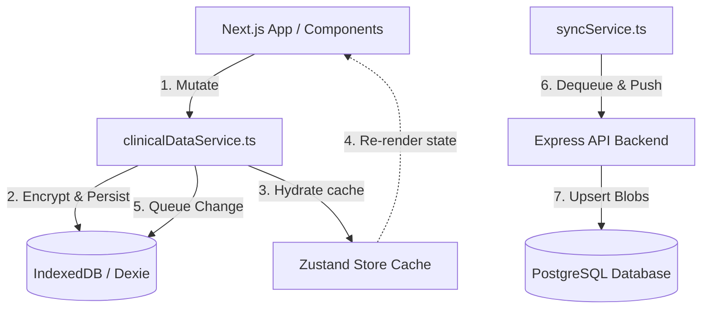

# ClinicalCWC — Monorepo Production Hub

ClinicalCWC is a personal, offline-first clinical workflow companion designed for physicians. It provides high-performance tracking for patient case aliases, tasks, drug references, telemetry tracking, and encrypted data backups. 

This repository is organized as a unified modern monorepo:
* **`apps/web`**: Next.js 15 App Router Frontend featuring pure Zustand state-cache, Dexie (IndexedDB) encrypted storage, and offline-first interfaces.
* **`apps/api`**: PostgreSQL + Prisma + Express JWT-authenticated REST Backend for storing and syncing encrypted data blobs.

---

## 🏛️ System Architecture



### Key Architectural Guidelines
1. **Single Source of Truth (SSOT)**: The database (IndexedDB) is the definitive authority. The Zustand Store is treated strictly as an in-memory cache/render target (Zero async operations or direct database writes occur inside `store.ts`).
2. **Deterministic Hydration**: Every clinical mutation triggers exactly one hydration restore from the database (`restoreDataFromDB`). Helper recalculators are isolated from triggering restorations.
3. **No Phantom UI Data**: All client reference items (including the formulary drug reference) reside in IndexedDB via seed structures, eliminating unpersisted UI-only datasets.
4. **Decoupled Entities**: UI components remain pure and stateless; ID generation, schema verification, and default attributes (e.g. `dueAt` timestamps) reside fully in the service layer.

---

## ⚙️ Requirements & Environment

### Prerequisites
- **Node.js** v20+
- **npm** v11+
- **PostgreSQL** (running locally or via Docker Compose)

### Environment Configurations

#### Frontend (`apps/web/.env`)
* `NEXT_PUBLIC_API_BASE_URL`: Express API endpoint (Defaults to `http://localhost:3001`).

#### Backend (`apps/api/.env`)
* `DATABASE_URL`: PostgreSQL connection string.
* `JWT_SECRET`: Secret key used to sign tokens (Fails fast on startup if missing).
* `FRONTEND_URL`: Allowed web origin (Defaults to `http://localhost:4028`).
* `PORT`: Server port (Defaults to `3001`).

---

## 🚀 Quick Start (Local Development)

### 1. Install Dependencies
Run from the root of the workspace:
```bash
npm install
```

### 2. Configure Environment Files
Copy env configurations from templates:
```bash
cp apps/api/.env.example apps/api/.env
```
Ensure you set a strong, secure `JWT_SECRET` and correct `DATABASE_URL` in the API `.env` file.

### 3. Database Initialization
Ensure your PostgreSQL instance is running, then run Prisma migrations:
```bash
npm --workspace clinicalcwc-api run migrate
```

### 4. Start the Application Stack
Launch the development servers:
```bash
# Start Express Backend
npm --workspace clinicalcwc-api run dev

# Start Next.js Frontend
npm --workspace clinicalcwc run dev
```

* **Frontend Hub**: `http://localhost:4028`
* **API Health Check**: `http://localhost:3001/health`

---

## 🧪 Testing & Code Verification

To verify architecture compliance, static types, and test suites prior to production lock, run the verification pipeline:

```bash
# Frontend Validation
npm --workspace clinicalcwc run lint          # ESLint & Prettier
npm --workspace clinicalcwc run type-check    # Strict TypeScript validation
npm --workspace clinicalcwc run test          # Vitest suite execution
npm --workspace clinicalcwc run build         # Next.js optimization build

# Backend Validation
npm --workspace clinicalcwc-api run lint
npm --workspace clinicalcwc-api run type-check
npm --workspace clinicalcwc-api run test
```

---

## 🔐 Security & Disaster Recovery

* **Zero Plaintext Storage**: Credentials are never stored plain-text in `localStorage`. Patient notes are encrypted client-side using AES-256-GCM prior to storage.
* **Encrypted Backups**: Backup settings export only encrypted blobs. Decrypted material is never exposed. Imports validate passcodes before commit.
* **Proactive Protection**: Decryption lockouts, rate backoffs, and telemetry logging trigger on passcode mismatch indicators.
* **Disaster Recovery Expectations**:
  - **RTO (Recovery Time Objective)**: < 2 minutes (Requires manual encrypted backup JSON file and passcode).
  - **RPO (Recovery Point Objective)**: Limited to the last manual backup or last successfully executed cloud sync check.

---

## 🐳 Docker Deployment

To spin up the PostgreSQL database and Express API container environment:
```bash
# Set JWT_SECRET in environment
export JWT_SECRET="your-strong-production-jwt-secret"

# Start Docker containers
docker compose -f infra/docker/docker-compose.yml up -d
```
The Next.js Web App is run independently with:
```bash
npm --workspace clinicalcwc run dev
```
